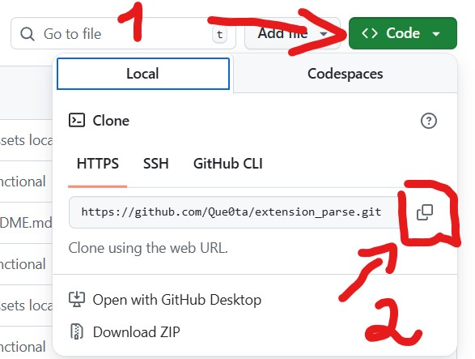

# 🔍 Розширення Data Parser

Просте розширення для браузера, яке парсить дані для звіту у структурованому вигляді.

---

## 🛠 Функції

- Парсинг даних для створення звіту
- Автоматичне виділення потрібної інформації  
- Можливість копіювати текст одразу з UI
- Зрозуміло та швидке у використанні

---

## 🌐 Вигляд UI


---

## ⚙️ Встановлення

1. Клонувати репозиторій або завантажити архів (у випадку архіву, потрібно розархівувати папку):
```bash
git clone https://github.com/your-username/data-parser-extension.git
```
<!--  -->

2. Зайти в ```chrome://extensions``` та включити **Режим розробника** у правому верхньому куті.

3. Завантажити папку з розширенням:


5. Запустити в **Google Chrome)**
